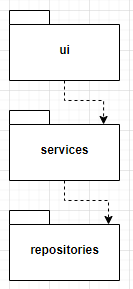
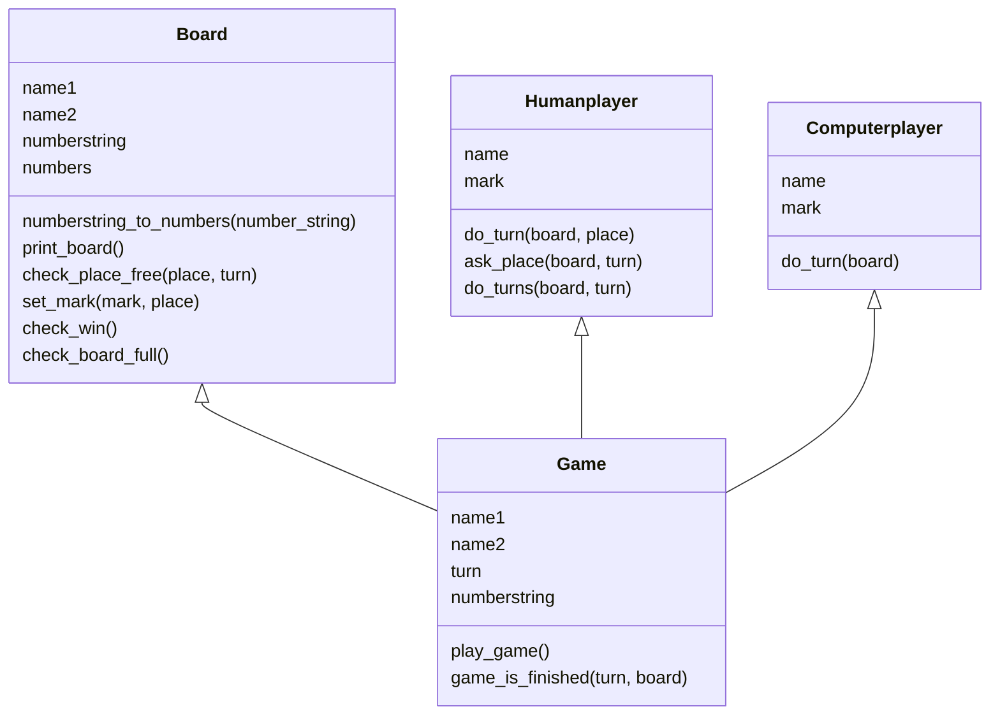
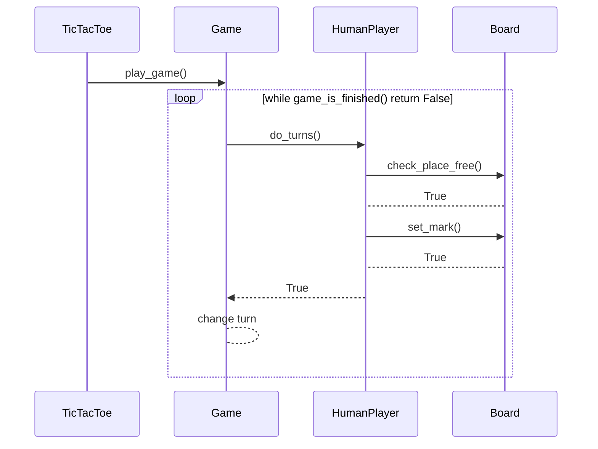

# Arkkitehtuuri

## Rakenne

Koodin pakkausrakenne on alla: 



Pakkaus _ui_ sisältää käyttöliittymän koodin ja _services_ sisältää sovelluslogiikan koodin, eli luokat Game, Board, 
Humanplayer ja Computerplayer. _Repositories_ vastaa tietojen tallentamisen tiedostoon ja tietojen lukemisen tiedostosta.

## Käyttöliittymä

Kun peli käynnistetään, avautuu valikko, jonka näyttämisestä vastaa TicTacToe-luokka. Jos halutaan aloittaa uusi peli,
TicTacToe luo services-pakkauksessa olevan Game-olion ja kutsuu Game-luokan metodeja. 

Jos halutaan jatkaa aiemmin tallennettua peliä, TicTacToe luo repositories-pakkauksen GameRepository-olion ja kutsuu 
GameRepository-luokan metodeja, jolloin tallennetun pelin tiedot saadaan luotua. Tämän jälkeen TicTacToe luo 
services-pakkauksessa olevan Game-olion ja kutsuu Game-luokan metodeja.

## Sovelluslogiikka 

Sovelluslogiikan muodostavat luokat Game, Board, Humanplayer ja Computerplayer. Ristinolla-pelissä Game-luokka 
kutsuu pelaamisessa Board-, Humanplayer- ja Computerplayer-luokan metodeja. Alla on pelin rakennetta kuvaava luokkakaavio.



## Pelin tallennus

Pakkauksen repositories luokka GameRepository vastaa pelin tallentamisesta. GameRepositoryn metodi store tallentaa pelin
pelaajat, vuorossa olevan pelaajan ja pelilaudan tiedostoon. GameRepositoryn metodi read lukee tiedostosta vastaavat tiedot. 

### Tiedostot

Peli tallettaa pelaajien nimet, pelilaudan ja vuorossa olevan pelaajan tiedot erilliseen
tekstitiedostoon seuraavassa formaatissa:
```bash
name1
name2
 123456789
1
```
Seuraava vuorossa olevaa pelaaja kuvataan joko numerolla 1 tai 2. 1 tarkoittaa, että ensimmäisenä
nimensä antanut pelaaja pelaa seuraavaksi. 

## Toiminnallisuus

### Uuden pelin aloittaminen
Uuden pelin aloittaminen alkaa kirjoittamalla aloitusvalikkoon "a", 
jonka jälkeen kirjoitetaan pelaajan nimi. Seuraavaksi valitaan, pelataanko
tietokonetta vai toista ihmispelaajaa vastaan. 
Alla oleva sekvenssikaavio kuvaa, miten peli etenee, kun kaksi ihmispelaajaa
pelaa keskenään. 

