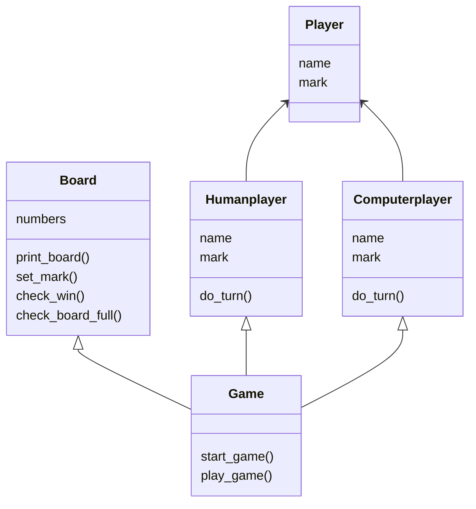

Ristinolla-pelissä Game-luokka käyttää pelaamisessa Board-, Humanplayer- ja Computerplayer-luokan olioita 
ja metodeja. 

```mermaid
 classDiagram
      Board <|-- Game
      Humanplayer <|-- Game
      Computerplayer <|-- Game
      Player <-- Humanplayer
      Player <-- Computerplayer
      class Board{
          numbers
          print_board()
          set_mark()
          check_win()
          check_board_full()

      }
      class Game{
          start_game()
          play_game()
      }
      class Humanplayer{
          name
          mark
          do_turn()
      }
      class Computerplayer{
          name
          mark
          do_turn()
      }
      class Player{
          name
          mark
      }
```