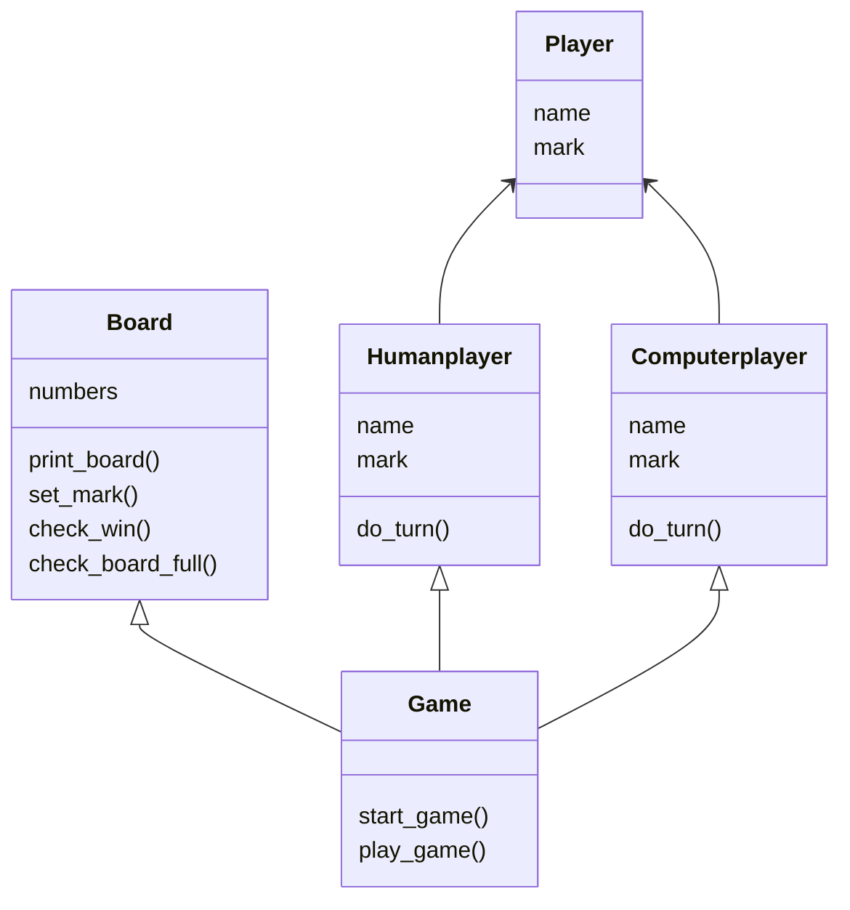

# Arkkitehtuuri

## Rakenne

Ristinolla-pelissä Game-luokka käyttää pelaamisessa Board-, Humanplayer- ja Computerplayer-luokan olioita 
ja metodeja. Alla on pelin rakennetta kuvaava luokkakaavio.



## Toiminnallisuus

Uuden pelin aloittaminen alkaa kirjoittamalla aloitusvalikkoon "a", 
jonka jälkeen kirjoitetaan pelaajan nimi. Seuraavaksi valitaan, pelataanko
tietokonetta vai toista ihmispelaajaa vastaan. 

```mermaid
 sequenceDiagram
      index ->> game : start_game()
      index ->> game : play_game()
      game ->> board : check_board_full()
      game <<-- board : False
      game ->> board : check_win()
      game <<-- board : False
      game ->> board : check_board_full()
      game <<-- board : False
      break when check_win() and check_board_full() return False
          game ->> humanplayer : do_turn()
          game <<-- board : True
      end
```