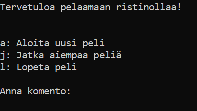
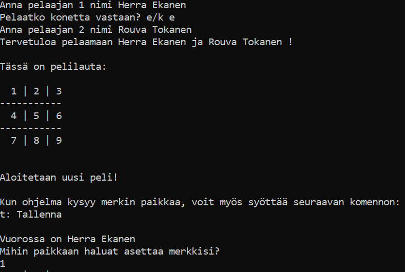
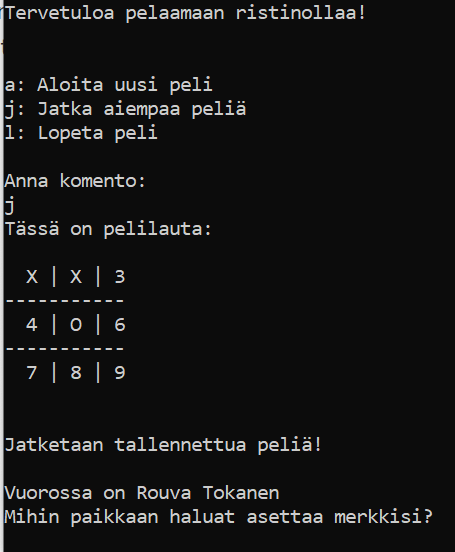

# Käyttöohje

Lataa viimeisen release tästä... (Lisätään kun ohjelma valmis!)

## Ohjelman käynnistäminen

1. poetry install asentaa riippuvuudet
 
2. poetry run invoke start käynnistää ristinolla-pelin

## Aloitusvalikko

Peli käynnistyy aloitusvalikkoon:

Peli aloitetaan kirjoittamalla haluttu komento komentoriville.

## Pelin pelaaminen

Jos halutaan aloittaa uusi peli, aloitusvalikkoon syötetään a komentoriville.
Tämän jälkeen syötetään ensimmäisen pelaajan nimi ja valitaan pelataanko konetta vai
toista ihmistä vastaan.

Tämän jälkeen aletaan syöttämään numeroita 1-9 sen mukaan, mihin paikkaan
pelilaudalle pelaaja haluaa merkkinsä asettaa.

## Pelin tallentaminen

Jos peli halutaan tallentaa, syötetään t kun peli kysyy minne pelaaja haluaa 
merkkinsä asettaa.

## Tallennetun pelin jatkaminen

Jos halutaan jatkaa aiemmin tallennettua peliä, tulee peli käynnistää ja 
aloitusvalikossa syöttää j. 

