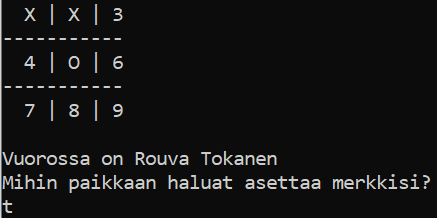

# Käyttöohje

Lataa [loppupalautus](https://github.com/lauurap/ot-harjoitustyo/releases) -nimisen 
releasen lähdekoodi (_Source code_) ja pura kyseinen zip. 

## Ohjelman käynnistäminen

Avaa komentorivi äsken ladatussa hakemistossa ja suorita seuraavat komennot:

1. Asenna riippuvuudet:
```bash
poetry install
```
 
2. Suorita tallennetun pelin tyhjennys:
```bash
poetry run invoke empty
```

3. Käynnistä peli:
```bash
poetry run invoke start
```


## Aloitusvalikko

Peli käynnistyy aloitusvalikkoon:


Peli aloitetaan kirjoittamalla haluttu komento komentoriville.

## Pelin pelaaminen

Jos halutaan aloittaa uusi peli, aloitusvalikkoon syötetään a komentoriville.
Tämän jälkeen syötetään ensimmäisen pelaajan nimi ja valitaan pelataanko konetta vai
toista ihmistä vastaan kirjoittamalla joko e (=ei) tai k (=kyllä).


Tämän jälkeen aletaan syöttämään numeroita 1-9 sen mukaan, mihin paikkaan pelilaudalle
vuorossa olevaa pelaaja haluaa merkkinsä asettaa.

## Pelin tallentaminen

Jos peli halutaan tallentaa, syötetään t kun peli kysyy minne pelaaja haluaa 
merkkinsä asettaa.



## Tallennetun pelin jatkaminen

Jos halutaan jatkaa aiemmin tallennettua peliä, tulee peli käynnistää ja 
aloitusvalikossa syöttää j. 

