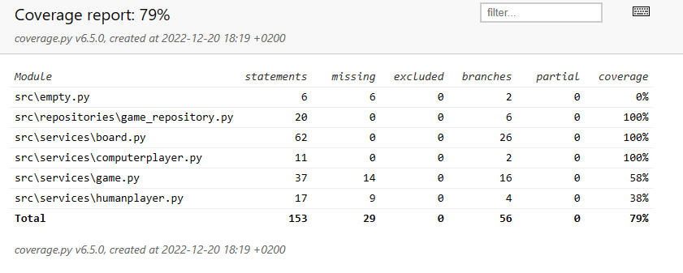

# Testausdokumentti

## Yksikkö- ja integraatiotestaus

### Sovelluslogiikka

Sovelluslogiikasta vastaavat `Board`-, `Computerplayer`-, `Humanplayer`- ja `Game`-luokat testataan
vastaavissa [TestBoard-](https://github.com/lauurap/ot-harjoitustyo/blob/master/src/tests/services/board_test.py), 
[TestComputerplayer-](https://github.com/lauurap/ot-harjoitustyo/blob/master/src/tests/services/computerplayer_test.py), 
[TestHumanplayer](https://github.com/lauurap/ot-harjoitustyo/blob/master/src/tests/services/humanplayer_test.py) ja 
[TestGame](https://github.com/lauurap/ot-harjoitustyo/blob/master/src/tests/services/game_test.py)-luokilla. 
Jokaisessa luokassa alustetaan vastaavalla alustusmetodilla lauta, tietokonepelaaja, ihmispelaaja 
ja peli, joiden avulla testataan kyseisten luokkien metodien toimintaa.
 

### Repositorio-luokka

`GameRepository`-luokan tiedoston lukeminen testataan 
[TestGameRepository](https://github.com/lauurap/ot-harjoitustyo/blob/master/src/tests/repositories/game_repository_test.py)-luokalla. 
Sovelluslogiikan `TestBoard`-luokassa tulee `Board`-luokan metodien lisäksi testattua 
`GameRepository`-luokan pelin tallennus-toiminto.

### Testauskattavuus

Käyttöliittymää lukuun ottamatta testauksen haarautumakattavuus on 79%.

Testaamatta jäi _empty.py_ sekä `Humanplayer`-luokissa metodit, joissa käytetään
käyttäjän antamaa komentoa. Myös `Game`-luokassa pelin toimimisesta vastaava looppi 
jäi testaamatta. Näiden toimivuus on kuitenkin testattu manuaalisesti. 

## Järjestelmätestaus

Järjestelmätestaus on suoritettu manuaalisesti.

### Asennus ja konfigurointi

Peli on haettu ja sitä on testattu [käyttöohjeen](./kayttoohje.md) kuvaamalla tavalla 
Windows- ja Linux -ympäristöissä. 

### Toiminnallisuudet

Kaikki [määrittelydokumentissa](./vaatimusmaarittely.md) ja [käyttöohjeessa](./kayttoohje.md)
kuvatut toiminnallisuudet on käyty läpi syöttämällä haluttuja komentoja (esim. paikkaa 
kysyttäessä syöttämällä numero) mutta myös syöttämällä virheellisiä komentoja 
(esim. paikkaa kysyttäessä syöttämällä kirjain). Tällöin
on myös testattu, että järjestelmä antaa järkeviä virheilmoituksia ja eikä kaadu virheellisten
komentojen seurauksena.

## Sovellukseen jääneet laatuongelmat

Pelaajien nimiksi voi antaa useamman tyhjän merkin pituisen merkkijonon. 
